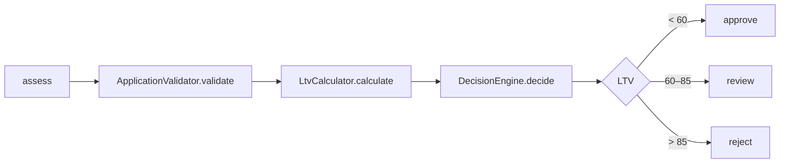

# Карта кода: расчёт решения approve / review / reject

## Участвующие файлы

- `backend/config/rules.php` — справочник бизнес-порогов (VIN, возраст/пробег авто, сумма, срок, LTV)
- `backend/src/Domain/VinValidator.php` — формат VIN (длина 17, A-Z/0-9, без I/O/Q)
- `backend/src/Domain/VehicleAge.php` — возраст авто = `currentYear − productionYear`
- `backend/src/Domain/ApplicationValidator.php` — валидация входных полей заявки
- `backend/src/Domain/LtvCalculator.php` — LTV = requested_amount / market_value × 100
- `backend/src/Domain/DecisionEngine.php` — маппинг LTV в решение
- `backend/src/Domain/AssessmentService.php` — оркестратор: валидация → LTV → решение → лимит
- `backend/src/Domain/ValidationException.php` — ошибка валидации (набор ошибок по полям)

## Порядок вызовов

Всё начинается с `AssessmentService::assess($payload)`:

1. `ApplicationValidator::validate($payload)` — возвращает нормализованный массив
   (`vin`, `year`, `mileage`, `market_value`, `requested_amount`, `term_months`)
   либо бросает `ValidationException`. Внутри по очереди:
   `VinValidator::isValid()`, `VehicleAge::inYears()` (для проверки возраста),
   затем проверки года, пробега, стоимости, суммы, срока.
2. `LtvCalculator::calculate($requestedAmount, $marketValue)` — LTV в процентах,
   округление до 2 знаков.
3. `DecisionEngine::decide($ltv)` — пороги из `rules['ltv']`
   (`approve_max = 60.0`, `review_max = 85.0`):
   - `LTV < 60` → `approve` (в коде строго `<`, хотя комментарий в файле говорит `<=` —
     расхождение докблока с реализацией)
   - `60 <= LTV <= 85` → `review`
   - `LTV > 85` → `reject`
4. Результат: `vehicle_age`, `ltv`, `decision`, `approved_limit`
   (запрошенная сумма при approve, иначе 0) и нормализованный `input`.

## Правило «пробег > 400 000 км → review»: куда встало бы

1. **Как отдельное правило решения (требуемая семантика)** — это логика
   `DecisionEngine`. Сейчас `decide(float $ltv)` принимает только LTV,
   пробег в него не попадает. Значит:
   - порог `400000` добавить в `rules.php` (например, в `vehicle`),
     не хардкодить — по конвенции проекта;
   - проверка встаёт в `DecisionEngine::decide()`: «mileage > порога → REVIEW»
     (до или после LTV-проверок — вопрос приоритета правил, в коде приоритетов нет);
   - `decide()` расширить до `decide(float $ltv, int $mileage)`
     (или передавать весь `$input`), а в `AssessmentService::assess()`
     на строке 33 передавать `$input['mileage']`.
2. **Куда не надо** — в `ApplicationValidator::validate()`. Там пробег уже
   проверяется, но с другой семантикой: невалидный пробег → `ValidationException`
   (заявка отвергается с ошибкой поля), а не `review`.

### Что уже есть из входных данных

- `mileage` есть в payload, нормализуется в `validate()` (int) и лежит в `$input`
  внутри `assess()` — данные доступны, их нужно только прокинуть в `DecisionEngine`.

### Чего не хватает

- Порога 400 000 в `config/rules.php` — нет (там `max_mileage_km = 500000`,
  но это лимит валидации, а не порог решения).
- Канала передачи mileage в `DecisionEngine` — нет: конструктор берёт только
  LTV-пороги, `decide()` принимает только LTV.
- Механизма «перезаписи» решения (что делать, если по LTV `reject`, а по пробегу
  `review`) — нет; сейчас решает только LTV, приоритетов правил в коде нет.

## Что уже сейчас проверяется про пробег

Единственное место — `ApplicationValidator.php`, строки 43–46: пробег приводится
к int и проверяется, что `0 <= mileage <= rules['vehicle']['max_mileage_km']`
(500 000 км из конфига). Нарушение → `ValidationException`, а не решение `review`.
На решение approve/review/reject пробег никак не влияет — `DecisionEngine` про него
не знает. Других упоминаний пробега в `Domain/` нет (только передача `mileage`
в нормализованном `$input` дальше в `AssessmentService`).
